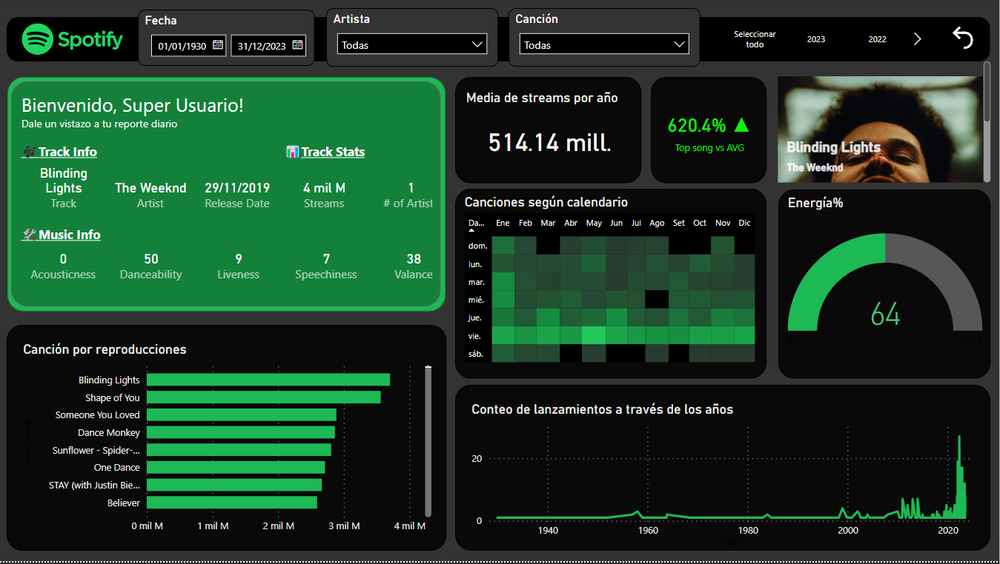
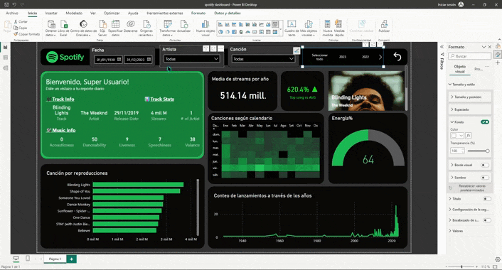

# "Exploración y Visualización de las Canciones Más Populares en Spotify 2023 con Power BI"

Este emocionante proyecto se centra en el análisis del conjunto de datos extraído de Kaggle, titulado "Most Streamed Spotify Songs 2023", utilizando Python. Además, aprovechamos la API de Spotify a través de un script en Python para enriquecer aún más nuestra comprensión de las canciones en el dataset. Finalmente, reunimos todos estos datos en un intuitivo y atractivo dashboard interactivo diseñado en Power BI, que sigue la estética y estilo de Spotify. Descubre y explora las tendencias musicales más calientes de 2023 de una manera atractiva y accesible.

## Estructura del Proyecto

Explica la estructura deL proyecto, incluyendo los archivos y carpetas principales.

- `limp_trans.py`: Script principal que realiza el procesamiento de datos.
- `analisis.ipynb`: Jupyter Notebook que contiene el análisis de los datos.
-  `spotify dashboard.pbix`: Dashboard interactivo en Power Bi.
- `spotify-2023.csv`: Este es el dataset original, recopilado desde Kaggle, que sirve como base para nuestro análisis.
- `spotify_updated.csv`: El dataset resultante tras la ejecución del script `limp_trans.py`, que incluye los datos procesados y enriquecidos.

## Requisitos

- Python 3.x
- Jupyter Notebook
- Librerías adicionales (pandas, spotipy, etc.)

## Configuración

1. Instala Python 3.x: [https://www.python.org/downloads/](https://www.python.org/downloads/)
2. Instala Jupyter Notebook: [https://jupyter.org/install](https://jupyter.org/install)
3. Instala las librerías adicionales: `pip install pandas spotipy`

## Uso

1. Ejecuta el script `limp_trans.py` para procesar los datos.
> **Nota:** El script no funcionara si no editas las credenciales del cliente ( 'id' y 'secret'), con las tuyas, más información  [Como Utilizar la API de Spotify](https://www.youtube.com/watch?v=PfL_v6A4fsI)
3. Abre el archivo `analisis.ipynb` en Jupyter Notebook para ver el análisis de los datos.
4. Abre el archivo `spotify dashboard.pbix` en Power Bi para ver el análisis y visualizaciones

## Propósito del proyecto 
Este proyecto se centra en responder las siguientes preguntas mediante el análisis del dataset de Spotify.
1.  ¿Cuáles son las canciones con más reproducciones en el dataset?
2.  ¿Cuál es la media de streams por año en el dataset?
3.  ¿Cuántos lanzamientos hubo por año en el dataset?
4.  ¿Cómo se distribuyen los lanzamientos según los días de la semana y los meses del año en el dataset?
5.  ¿Cuál es la media de las características musicales en el dataset?
6.  ¿Cuál es la diferencia relativa de la canción más popular con respecto al promedio de reproducciones en el dataset?
7.  ¿Cuál es el porcentaje de diferencia de la canción más popular con respecto al promedio de reproducciones en el dataset?
## Sobre el Dataset 

### Descripción:

Este conjunto de datos contiene una lista completa de las canciones más famosas de 2023, tal como se enumeran en Spotify. El conjunto de datos ofrece una gran cantidad de características más allá de lo que normalmente se encuentra en conjuntos de datos similares. Proporciona información detallada sobre las atributos de cada canción, su popularidad y su presencia en varias plataformas de música. El conjunto de datos incluye información como el nombre de la canción, el nombre del artista o artistas, la fecha de lanzamiento, listas de reproducción y gráficos de Spotify, estadísticas de transmisión, presencia en Apple Music, presencia en Deezer, gráficos de Shazam y diversas características de audio.

### Características Clave:

| Características Clave         | Descripción                                                           |
|------------------------------|-----------------------------------------------------------------------|
| track_name                    | Nombre de la canción                                                  |
| artist(s)_name                | Nombre del o de los artistas de la canción                            |
| artist_count                  | Número de artistas que contribuyen a la canción                        |
| released_year                 | Año en que se lanzó la canción                                         |
| released_month                | Mes en que se lanzó la canción                                         |
| released_day                  | Día del mes en que se lanzó la canción                                  |
| in_spotify_playlists          | Número de listas de reproducción de Spotify en las que se incluye la canción |
| in_spotify_charts             | Presencia y posición de la canción en las listas de Spotify           |
| streams                       | Número total de reproducciones en Spotify                            |
| in_apple_playlists            | Número de listas de reproducción de Apple Music en las que se incluye la canción |
| in_apple_charts               | Presencia y posición de la canción en las listas de Apple Music        |
| in_deezer_playlists           | Número de listas de reproducción de Deezer en las que se incluye la canción |
| in_deezer_charts              | Presencia y posición de la canción en las listas de Deezer             |
| in_shazam_charts              | Presencia y posición de la canción en las listas de Shazam             |
| bpm                          | Pulsos por minuto, una medida del tempo de la canción                  |
| key                          | Tonalidad de la canción                                                |
| mode                         | Modo de la canción (mayor o menor)                                      |
| danceability_%               | Porcentaje que indica cuán adecuada es la canción para bailar          |
| valence_%                    | Positividad del contenido musical de la canción                        |
| energy_%                     | Nivel de energía percibido de la canción                                |
| acousticness_%               | Cantidad de sonido acústico en la canción                               |
| instrumentalness_%           | Cantidad de contenido instrumental en la canción                        |
| liveness_%                   | Presencia de elementos de interpretación en vivo                        |
| speechiness_%                | Cantidad de palabras habladas en la canción                             |

## Sobre el script principal

**`limp_trans.py`**

Este script de Python está diseñado para procesar un dataset de canciones extraído de Spotify. A continuación, se describen las principales funcionalidades del script:

1.  **Importación de Bibliotecas**: El script utiliza la biblioteca Pandas para la manipulación de datos y la biblioteca Spotipy para interactuar con la API de Spotify. También se importa la clase `SpotifyClientCredentials` para la autenticación.
    
2.  **Carga del Dataset**: El script carga el dataset de canciones ("spotify-2023.csv") en un DataFrame de Pandas. El archivo CSV se carga con la codificación "ISO-8859-1".
    
3.  **Limpieza de Datos**: El script realiza una limpieza de los datos. Elimina las filas con datos erróneos en la columna 'streams' y convierte esta columna a tipo numérico.
    
4.  **Creación de una Columna de Fecha**: Se crea una nueva columna llamada 'fecha' en el DataFrame combinando las columnas 'released_year', 'released_month' y 'released_day' para representar la fecha de lanzamiento de cada canción.
    
5.  **Configuración de Credenciales del Cliente Spotify**: La sección de código comentada muestra cómo configurar las credenciales del cliente de Spotify para acceder a la API de Spotify. Para que funcione, debes descomentar esta parte y proporcionar tus propias credenciales de Spotify.
    
6.  **Obtención de la Portada del Álbum**: El script incluye una función llamada `get_album_cover` que busca la canción en la API de Spotify y obtiene la URL de la imagen de la portada del álbum de la canción. Luego, agrega esta URL como una nueva columna 'album_image' en el DataFrame.
    
7.  **Exportación del DataFrame**: Finalmente, el script exporta el DataFrame procesado a un nuevo archivo CSV llamado 'spotify_updated.csv' con la misma codificación "ISO-8859-1".

## Sobre el Dashboard
El dashboard esta inspirado en este video:  [Advanced Power BI Project](https://www.youtube.com/watch?v=ZSrVOyKAC4Y&t=465s), donde explicame gran parte de como se llevo a cabo este proyecto.

### Tabla Calendario - Bravo
Una parte fundamental de este dashboard es la utilización de la herramienta externa **Bravo**, que facilita la creación de una tabla de calendario en Power BI. Esta tabla de calendario desempeña un papel crucial al permitirnos relacionar de manera sencilla las fechas asociadas a las canciones con otras métricas y dimensiones, lo que mejora significativamente la calidad del análisis de datos y la generación de visualizaciones efectivas. La integración de la tabla de calendario Bravo simplifica la gestión de fechas y optimiza la presentación de información en el dashboard.

### Métricas y KPIs

Dentro del archivo Power BI, encontrarás una serie de métricas y KPIs cuidadosamente seleccionados para facilitar la generación de visualizaciones informativas y el análisis de datos. A continuación, se describen las principales métricas y su propósito:

1.  **Average Stream per Year**: Esta métrica calcula el promedio de reproducciones por año. Proporciona una idea de cómo evolucionan las reproducciones a lo largo del tiempo, lo que puede ser esencial para identificar tendencias y patrones.
    
2.  **MaxStreams**: Muestra el número máximo de reproducciones entre todas las canciones en el conjunto de datos. Esto destaca la canción más popular en términos de reproducciones.
    
3.  **Percent_val**: Calcula el promedio de la característica musical "energy_%" en el conjunto de datos. Esta métrica indica la energía percibida en la música y puede ser relevante para evaluar la variabilidad en las canciones.
    
4.  **Top song streams**: Determina el número total de reproducciones de la canción más popular. Esto es fundamental para identificar la canción líder en términos de reproducciones.
    
5.  **Top song vs AVG**: Esta métrica compara el rendimiento de la canción más popular con el promedio de reproducciones por año. Proporciona información sobre cuánto supera o queda por debajo la canción líder en comparación con el promedio.
    
6.  **Top song vs avg val**: Este **KPI** calcula la diferencia relativa en reproducciones entre la canción más popular y el promedio de reproducciones por año. Esta métrica es útil para comprender la magnitud de la diferencia en términos porcentuales.
    
7.  **Track**: Cuenta el número total de canciones en el conjunto de datos. Esta métrica es esencial para conocer la cantidad de canciones incluidas en el análisis.

## Contribuciones

Explica cómo otros pueden contribuir a tu proyecto.

1. Haz un fork del repositorio.
2. Crea una rama con tu nueva funcionalidad: `git checkout -b nueva-funcionalidad`
3. Realiza los cambios necesarios y haz commit: `git commit -m "Agrega nueva funcionalidad"`
4. Haz push a la rama: `git push origin nueva-funcionalidad`
5. Abre un pull request en GitHub.
## Agradecimientos
**Power BI Spark**: Agradezco a autor del canal por proporcionar el valioso recurso que inspiró la creación de este proyecto. Su video [Advanced Power BI Project](https://www.youtube.com/watch) proporcionó información esencial y pautas que fueron fundamentales para el desarrollo del dashboard en Power BI.

## Contacto

Si deseas ponerte en contacto conmigo o saber más sobre mis proyectos, puedes encontrarme en las siguientes plataformas:

-   LinkedIn: [Alfred Mamani Valdez](https://www.linkedin.com/in/alfred-mamani-valdez/)
-   Kaggle: [Zanderman](https://www.kaggle.com/zanderman)
-   GitHub: [alfredsander](https://github.com/alfredsander)
-   Correo Electrónico: [alfredmamanivaldez@gmail.com](mailto:alfredmamanivaldez@gmail.com)

¡No dudes en contactarme si tienes alguna pregunta o comentario sobre este proyecto!
